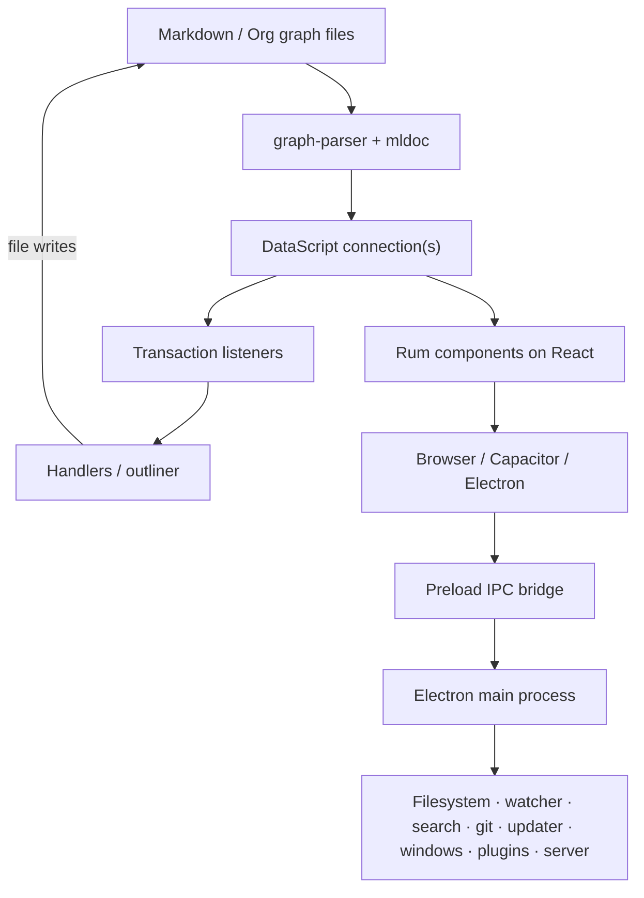

# Logseq OG repository analysis

This analysis describes the repository at commit `29caab203060c13931d5cc9d908066d6589d2214` (2026-08-01). It is based on the checked-in source and configuration, not on generated output under `static/`, installed dependencies, or historical assumptions about upstream Logseq.

## Executive summary

Logseq OG is a local-first, cross-platform outliner whose primary implementation is ClojureScript. The same renderer build runs in a browser, an Electron desktop shell, and Capacitor mobile shells. Its application model is built around DataScript: Markdown/Org files are parsed into an in-memory graph, transactions drive reactive UI updates, and serialized graph databases are cached in IndexedDB or desktop storage. Rum supplies the ClojureScript component model while React supplies the rendering runtime.

The repository is a federated monorepo rather than a single-package workspace. Clojure local-root libraries under `deps/` form the reusable domain core; the main CLJS app lives under `src/main`; Electron main-process code lives under `src/electron`; TypeScript packages provide the plugin SDK, UI islands, Amplify integration, and a vendored tldraw fork. Clojure CLI/Shadow CLJS, Babashka, Yarn, Gulp, Parcel, Webpack, Electron Forge, and Capacitor each own a different part of the build.

The architecture's strongest qualities are a portable functional domain layer, a clear graph/database abstraction, local-first operation, and reuse of one renderer across platforms. Its main costs are broad mutable global state, implicit startup ordering, a very large IPC capability surface, multiple dependency/build universes, generated artifacts mixed with sources, and significant version skew between React and Shadow CLJS declarations.

## Documents

- [Architecture](architecture.md) — runtime topology, startup, state, persistence, and major flows.
- [Repository map](repository-map.md) — ownership and purpose of directories and packages.
- [Build and delivery](build-and-delivery.md) — compilers, task runners, platform packaging, testing, and CI observations.
- [Architectural assessment](assessment.md) — strengths, risks, and prioritized recommendations.

## Fast orientation

The most useful entry points are:

1. [`shadow-cljs.edn`](../shadow-cljs.edn) defines browser, Electron, publishing, test, and Storybook builds.
2. [`frontend.core`](../src/main/frontend/core.cljs) initializes the shared renderer.
3. [`frontend.handler`](../src/main/frontend/handler.cljs) is the closest equivalent to a system lifecycle.
4. [`frontend.db`](../src/main/frontend/db.cljs) exposes graph database lifecycle and persistence.
5. [`electron.core`](../src/electron/electron/core.cljs) owns the Electron application lifecycle.
6. [`electron.handler`](../src/electron/electron/handler.cljs) is the central renderer-to-main IPC dispatcher.
7. [`bb.edn`](../bb.edn) is the preferred developer task catalog; [`gulpfile.js`](../gulpfile.js) assembles assets and platform bundles.

## High-level topology

## Scope and confidence

The analysis covers checked-in architecture, dependency declarations, build paths, test layout, and operational risks. It does not claim runtime performance measurements, test pass status, production deployment state, or vulnerability findings; those require executing full builds and platform-specific test suites. Counts from the tree are deliberately treated as orientation only because vendored code and generated output would otherwise distort them.
