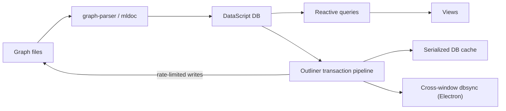
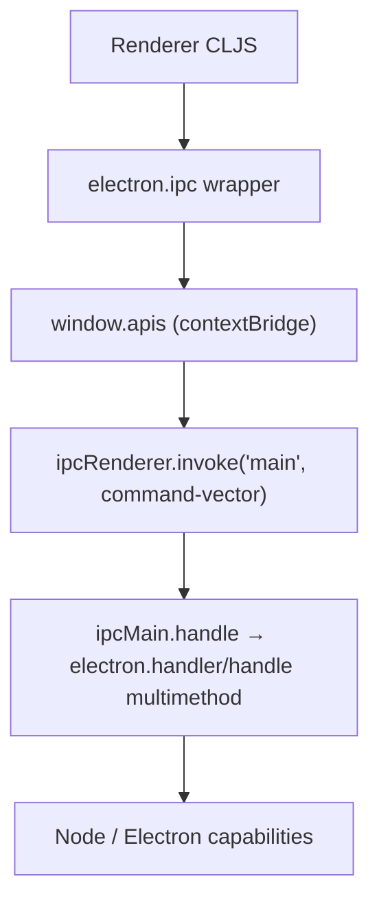

# Runtime architecture

## Deployment model

One ClojureScript renderer serves two application hosts:

- Browser: Shadow CLJS serves or builds `static/js`, and the app uses browser
  storage/filesystem capabilities.
- Desktop: Electron loads assembled HTML and JS, while a CLJS-compiled Node main
  process supplies privileged capabilities. The separate `publishing` build
  creates a read-oriented browser application from exported graph data. Code
  editor, Excalidraw, and tldraw are lazy Shadow modules depending on the main
  module, reducing initial loading cost.

## Renderer startup

[`frontend.core/init`](../src/main/frontend/core.cljs) delegates first to plugin
setup and then to
[`frontend.handler/start!`](../src/main/frontend/handler.cljs). The startup
sequence is imperative and order-sensitive:

1. Install global error handling and platform listeners.
2. Register component callbacks and command-palette commands in global state.
3. Restore user tokens and mark the database as restoring.
4. Attach Electron listeners when hosted by Electron.
5. Mount the Rum root and start fragment-based Reitit routing.
6. Initialize localization, instrumentation, IndexedDB, reactive queries, and
   the event loop.
7. Discover repositories, create/restore the current DataScript connection,
   restore graph/global/plugin configuration, and install transaction/file
   watchers.
8. Start background transaction batching, rate-limited file writes, sleep/wake
   detection, persisted variables, and periodic instrumentation.

The source calls `frontend.handler` the closest thing to a system, accurately
reflecting that there is no Integrant/Mount/Component lifecycle graph. Hot
reload calls `stop!`, but that function currently only prints; most listeners,
intervals, and loops are not explicitly torn down by the renderer lifecycle.

## UI and state model

Rum macros (`rum/defc`, `rum/defcs`) define most views and render through React.
The root page selects a route-specific view from Reitit. React is configured as
a global in Shadow CLJS, allowing separately built JavaScript UI packages to
share a host React runtime.

There are three overlapping state mechanisms:

1. [`frontend.state/state`](../src/main/frontend/state.cljs) is a large global
   atom holding navigation, editor, UI, graph, sync, plugin, and platform state.
2. DataScript connections hold graph entities and transact structured changes.
3. Rum local state/mixins and reactive database query subscriptions trigger
   component updates.

The design works well for an interactive graph editor because a DataScript
transaction is both the domain mutation and the source for query invalidation.
The cost is implicit coupling: code can transact, update the global atom,
publish an event, or call a registered component/service callback. Understanding
a feature often requires tracing all four mechanisms.

## Graph data lifecycle

DataScript is a projection/cache and active editing model rather than the only
durable store. [`frontend.db`](../src/main/frontend/db.cljs) creates one
connection per repository using the shared schema, restores serialized data,
migrates old schema versions, adds built-in pages, and registers a transaction
listener. Browser transactions schedule persistence when input and DB activity
become idle. Electron transactions can serialize transaction data over IPC to
other windows that show the same graph.

The outliner pipeline is installed globally by assigning
`frontend.db/*db-listener` to
`frontend.modules.outliner.datascript/after-transact-pipelines`. This hook
bridges generic database transactions to application-specific effects such as
file serialization. It is powerful but makes transaction metadata and listener
ordering part of the effective architecture.

Persistence is intentionally multi-layered:

- User graph files are portable, inspectable durable data.
- DataScript serialization is a performance cache with schema migration.
- IndexedDB/local storage retains browser application state.
- Electron owns filesystem access, watchers, backups, and cross-window
  coordination.
- File-sync modules add remote graph synchronization and conflict/merge
  behavior.

## Electron process boundary

The Electron main process is itself compiled from ClojureScript using Shadow's
`:node-script` target.
[`electron.core/main`](../src/electron/electron/core.cljs) takes a
single-instance lock, registers custom protocols, creates the main window, opens
search databases, configures git auto-commit, and installs updater, IPC, server,
exception, window, and app lifecycle handlers.

Browser windows use `nodeIntegration: false` and `contextIsolation: true`.
[`resources/js/preload.js`](../resources/js/preload.js) exposes a curated
`window.apis` object with IPC, shell, clipboard, updater, window, and utility
operations. Renderer-side `electron.ipc` wrappers then invoke the common `main`
channel. [`electron.handler/handle`](../src/electron/electron/handler.cljs) is a
multimethod dispatching command vectors to filesystem, graph, watcher, export,
plugin, search, server, git, and window operations.

The boundary has good baseline isolation settings but is capability-rich. The
preload accepts arbitrary channel names in some helpers and the main dispatcher
exposes many privileged operations through one channel. Security therefore
depends on exhaustive argument validation in each handler and on navigation/CSP
controls, rather than on a narrow typed capability interface. The window
explicitly sets `sandbox: false`; privileged custom protocols include
`bypassCSP: true`; and development disables web security. These may be
operationally necessary, but they deserve explicit threat modeling and
regression tests.

## Plugin architecture

The plugin system spans both processes and a separately published TypeScript
SDK:

- `libs` produces `@logseq/libs`, the plugin author API/runtime client.
- `logseq.api` and `logseq.sdk` implement host-side APIs and models.
- `frontend.handler.plugin` starts plugin hosts, lifecycle hooks, editor hooks,
  commands, services, UI items, themes, and settings.
- `frontend.state` stores installed plugin registries and hooks.
- `electron.plugin` downloads, validates, installs, updates, and removes plugin
  packages in the desktop data directory.

Plugins are primarily an Electron capability and can contribute commands, hooks,
UI, themes, and search services. This is a broad extension surface, making API
compatibility, permission boundaries, package authenticity, and failure
isolation architectural concerns rather than implementation details.

## Publishing and whiteboards

The publishing build has its own entry point and creates a DataScript connection
from exported graph data. It reuses much of the renderer and lazy extension
modules while setting a compile-time `PUBLISHING` define.

Whiteboards use a vendored tldraw monorepo. The CLJS application integrates it
through `frontend.extensions.tldraw` and stores whiteboard shapes/pages in the
same graph transaction model. This preserves graph semantics but carries a
substantial independently tooled React/TypeScript codebase inside the
repository.
