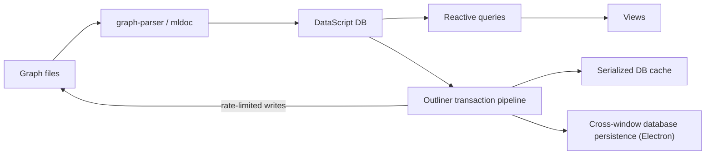
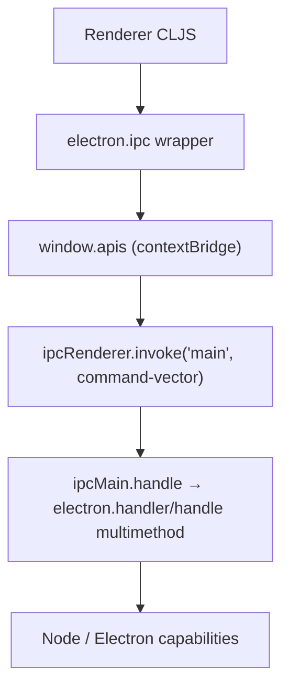

# Runtime architecture

## Deployment model

One ClojureScript renderer serves two application hosts:

- Browser: Shadow CLJS serves or builds `static/js`, and the app uses browser
  storage/filesystem capabilities.
- Desktop: Electron loads assembled HTML and JS, while a CLJS-compiled Node main
  process supplies privileged capabilities. The separate `publishing` build
  creates a read-oriented browser application from exported graph data. Code
  editor, Excalidraw, and tldraw are lazy Shadow modules depending on the main
  module, reducing initial loading cost.

## Renderer startup

[`frontend.core/init`](../src/main/frontend/core.cljs) starts the shared
renderer and then delegates application startup to
[`frontend.handler/start!`](../src/main/frontend/handler.cljs). The startup
sequence is imperative and order-sensitive:

1. Install global error handling and platform listeners.
2. Register component callbacks and command-palette commands in global state.
3. Mark the local database as restoring.
4. Attach Electron listeners when hosted by Electron.
5. Mount the Rum root and start fragment-based Reitit routing.
6. Initialize localization, instrumentation, IndexedDB, reactive queries, and
   the event loop.
7. Discover repositories, create/restore the current DataScript connection,
   restore graph/global configuration, and install transaction/file watchers.
8. Start background transaction batching, rate-limited file writes, sleep/wake
   detection, persisted variables, and periodic instrumentation.

The source calls `frontend.handler` the closest thing to a system, accurately
reflecting that there is no Integrant/Mount/Component lifecycle graph. Hot
reload calls `stop!`, but that function currently only prints; most listeners,
intervals, and loops are not explicitly torn down by the renderer lifecycle.

## UI and state model

Rum macros (`rum/defc`, `rum/defcs`) define most views and render through React.
The root page selects a route-specific view from Reitit. React is configured as
a global in Shadow CLJS, allowing separately built JavaScript UI packages to
share a host React runtime.

There are three overlapping state mechanisms:

1. [`frontend.state/state`](../src/main/frontend/state.cljs) is a large global
   atom holding navigation, editor, UI, graph, persistence, and platform state.
2. DataScript connections hold graph entities and transact structured changes.
3. Rum local state/mixins and reactive database query subscriptions trigger
   component updates.

The design works well for an interactive graph editor because a DataScript
transaction is both the domain mutation and the source for query invalidation.
The cost is implicit coupling: code can transact, update the global atom,
publish an event, or call a registered component/service callback. Understanding
a feature often requires tracing all four mechanisms.

## Graph data lifecycle

DataScript is a projection/cache and active editing model rather than the only
durable store. [`frontend.db`](../src/main/frontend/db.cljs) creates one
connection per repository using the shared schema, restores serialized data,
migrates old schema versions, adds built-in pages, and registers a transaction
listener. Browser transactions schedule persistence when input and DB activity
become idle. Electron transactions can serialize transaction data over IPC to
other windows that show the same graph.

The outliner pipeline is installed globally by assigning
`frontend.db/*db-listener` to
`frontend.modules.outliner.datascript/after-transact-pipelines`. This hook
bridges generic database transactions to application-specific effects such as
file serialization. It is powerful but makes transaction metadata and listener
ordering part of the effective architecture.

Persistence is intentionally multi-layered:

- User graph files are portable, inspectable durable data.
- DataScript serialization is a performance cache with schema migration.
- IndexedDB/local storage retains browser application state.
- Electron owns filesystem access, watchers, backups, and cross-window
  coordination.

## Electron process boundary

The Electron main process is itself compiled from ClojureScript using Shadow's
`:node-script` target. `electron.core/main` takes a single-instance lock,
registers custom protocols, creates the main window, opens search databases, and
installs updater, IPC, exception, window, and app lifecycle handlers.

Browser windows use `nodeIntegration: false` and `contextIsolation: true`.
[`resources/js/preload.js`](../resources/js/preload.js) exposes a curated
`window.apis` object with IPC, shell, clipboard, updater, window, and utility
operations. Renderer-side `electron.ipc` wrappers invoke the common `main`
channel. [`electron.handler/handle`](../src/electron/electron/handler.cljs) is a
multimethod dispatching command vectors to filesystem, graph, watcher, export,
theme, search, and window operations.

The boundary has good baseline isolation settings but remains capability-rich:
the main dispatcher exposes many privileged operations through one channel.
Security therefore depends on exhaustive argument validation in each handler and
on navigation/CSP controls, rather than on a narrow typed capability interface.
The preload no longer exposes a generic arbitrary-channel invoke helper, and the
removed plugin/API-server paths have no renderer bridge. The window explicitly
sets `sandbox: false`; privileged custom protocols include `bypassCSP: true`;
and development disables web security. These may be operationally necessary, but
they deserve explicit threat modeling and regression tests.

## Graph-local themes

Themes are CSS-only assets installed manually in the active graph. Each theme
lives in its own immediate child directory under
`<graph>/logseq/themes/<theme-folder>/`. The supported manifest is a
`package.json` containing `logseq.themes`, whose entries identify a local CSS
file through `url` and may provide `name`, `description`, and `mode`.

Electron enumerates only those graph-local directories and returns file URLs for
existing CSS entries. Relative paths, URLs, JavaScript entries, traversal, and
missing files are rejected; no theme code executes. The renderer stores the
selected theme in the graph configuration, injects one stylesheet, removes it
when selection changes or the graph changes, and refreshes discovery when the
theme directory changes. Built-in light, dark, and system modes remain separate
from graph-local themes.

The application no longer has a plugin host, marketplace, plugin SDK bridge, or
developer HTTP API server. External customization is limited to manually copied
local CSS themes; application behavior is provided by built-in features.

## Publishing and whiteboards

The publishing build has its own entry point and creates a DataScript connection
from exported graph data. It reuses much of the renderer and lazy extension
modules while setting a compile-time `PUBLISHING` define.

Whiteboards use a vendored tldraw monorepo. The CLJS application integrates it
through `frontend.extensions.tldraw` and stores whiteboard shapes/pages in the
same graph transaction model. This preserves graph semantics but carries a
substantial independently tooled React/TypeScript codebase inside the
repository.
