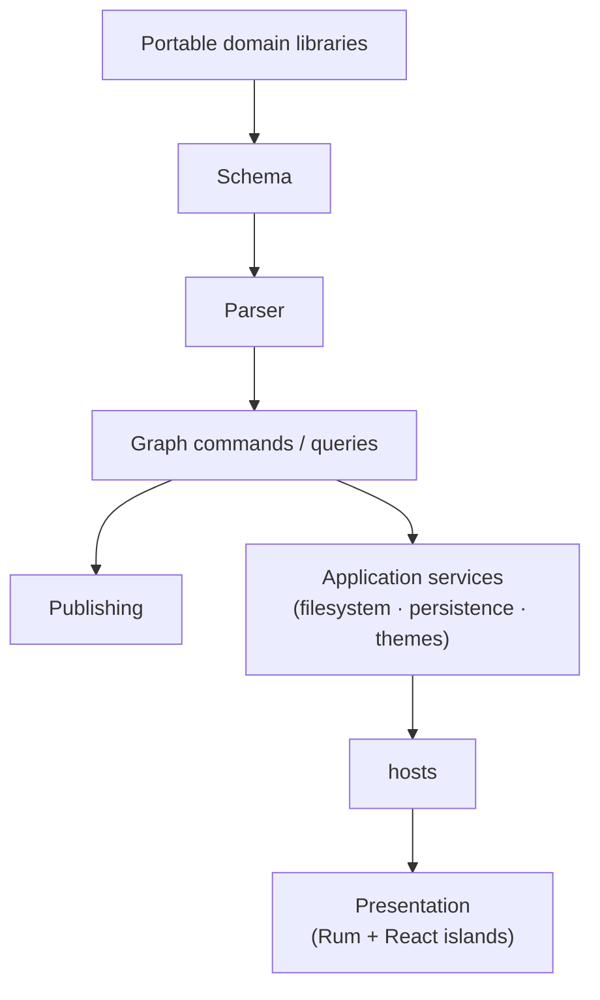

# Architectural assessment

## What is working well

### Portable domain model

The graph parser, schema/rules, common utilities, and publishing logic are
extracted into small Clojure local-root libraries designed to run in both
compiled CLJS and Node via `nbb-logseq`. This is an effective form of reuse:
domain semantics are shared without forcing the Electron shell, UI, or browser
runtime into command-line use cases.

### Local-first data ownership

Human-readable graph files remain durable user data while DataScript provides
fast indexed queries and reactive transactions. Serialized database caches are
disposable/migratable. This separation is resilient, portable, and aligned with
the product's graph model.

### Cross-platform renderer reuse

Browser, Electron, and publishing builds share most application code. Platform
checks and adapter namespaces isolate enough host behavior to avoid separate
products, while Shadow compile-time defines allow meaningful specialization.

### Built-in application surface

Multimethods, protocols, transaction metadata, event publication, and registered
callbacks provide the built-in application surface. Lazy Shadow modules keep
large optional editors/drawing tools out of the main module. Graph-local themes
are deliberately limited to local CSS assets rather than executable extensions.

## Principal risks

| Priority | Risk                                               | Evidence and impact                                                                                                                                                                                              |
| -------- | -------------------------------------------------- | ---------------------------------------------------------------------------------------------------------------------------------------------------------------------------------------------------------------- |
| High     | Electron capability boundary is broad              | The main channel dispatches many filesystem, shell, export, search, and window operations. A compromised renderer still has a large attack surface unless every command validates origin, operation, and paths.  |
| High     | Lifecycle and state are implicit                   | `frontend.handler/start!` starts listeners, intervals, async loops, and watchers, while `stop!` has no teardown. Global atom/database hooks and registries make tests and hot reload prone to retained effects.  |
| High     | Dependency/runtime skew                            | Shadow versions differ between npm and Clojure declarations; React 17 is the host while the UI package declares React 18 and React 17 types. External globals hide incompatibility until runtime.                |
| Medium   | Build graph is fragmented                          | Babashka, Yarn, Gulp, Parcel, Webpack, Forge, and nested postinstalls share ownership without a machine-readable end-to-end DAG. Clean and reproducible builds are difficult to reason about.                    |
| Medium   | Data side effects hinge on transaction conventions | Persistence, file writing, cross-window database updates, and reactive refresh depend on listeners and transaction metadata. Missing or incorrect metadata can cause loops, stale files, or skipped persistence. |
| Medium   | Global state is a dependency hub                   | UI state, callbacks, graph state, and platform state coexist in `frontend.state`, increasing feature coupling and making ownership unclear.                                                                      |
| Medium   | Generated and source assets overlap                | `static` is build output, runtime package, and persistent dependency directory. This increases stale-artifact and packaging risk.                                                                                |
| Medium   | Visible CI contract is absent                      | This checkout has extensive test tooling but no workflow definitions, so release gates and platform coverage cannot be verified locally.                                                                         |

## Recommended sequence

### 1. Harden and type the Electron boundary

Inventory every preload method and `electron.handler/handle` dispatch value.
Replace generic channel invocation with named capabilities, schema-validate
payloads and return values (Malli is already used elsewhere), validate all paths
against explicit roots, and test rejected calls. Enable Electron sandboxing
where feasible and document exceptions. Add a threat model for custom protocols,
graph-local theme paths, navigation, CSP bypasses, and external URL handling.

This should precede broad refactoring because it reduces the highest-consequence
risk without requiring changes to the domain model.

### 2. Make lifecycle resources explicit

Turn startup functions into components returning idempotent teardown functions.
Track window/browser listeners, timers, core.async loops, file watchers,
DataScript listeners, and theme refresh hooks in a small system registry. Make
`stop!` execute teardown in reverse order. This improves hot reload, test
isolation, shutdown correctness, and observability.

An incremental pattern fits the existing code:

```clojure
(defn start-network-watcher! []
  (.addEventListener js/window "online" handle-change)
  (.addEventListener js/window "offline" handle-change)
  #(.removeEventListener js/window "online" handle-change))
```

The real implementation would remove both listeners and be collected by the
application lifecycle.

### 3. Establish one dependency policy

Choose and document authoritative Shadow and React versions. Add an automated
check for conflicting versions across manifests and confirm that externalized
React consumers are tested against the exact host global. Declare direct Clojure
dependencies directly rather than relying on transitive local roots.

Do not force every subproject into one workspace immediately; the vendored
tldraw fork and package-local UI builds may benefit from isolation. First
produce a root command that installs and verifies all intended subprojects
deterministically.

### 4. Describe the build as an artifact DAG

Create one root task for each supported artifact—web renderer, desktop app,
publishing site, and UI bundle—with declared inputs and outputs. Keep Babashka
as the human-facing orchestrator, but move build output to clean
platform-specific directories. Eliminate build-on-install where practical.

### 5. Reduce global state by ownership, not wholesale rewrite

Split runtime registries (component callbacks) from serializable UI/application
state. Introduce narrow service/context maps at feature boundaries and keep
DataScript as the graph model. Favor selectors and commands over direct `swap!`
from views. A React rewrite would not solve the dependency problem; explicit
ownership would.

### 6. Make transaction effects observable

Document required transaction metadata and centralize constructors for common
transaction types. Add property/integration tests covering edit -> DataScript ->
file -> watcher -> parser round trips, plus cross-window database propagation.
Instrument queue depth, transaction duration, persistence delay, and file-write
failures in development builds.

### 7. Restore a visible quality matrix

Check in or generate a single CI manifest covering root CLJS tests,
portable-library CLJS/nbb compatibility, Playwright, lint/schema validation,
package builds, and at least smoke packaging per platform. Local `bb verify`
should mirror all platform-independent gates.

## Changes to avoid

- Do not replace DataScript solely to obtain stricter layering; it is central to
  query semantics, reactive rendering, and publishing.
- Do not migrate Rum to JavaScript React components as a prerequisite for
  modularity. The current problems are dependency ownership and lifecycle
  management, not the view syntax.
- Do not collapse all nested packages and lockfiles before defining version and
  release policy. Some isolation is deliberate and useful.

## Suggested target architecture

The natural evolution is still a modular monolith:



The key change is enforceable direction: presentation issues commands and
subscribes to queries; application services own effects and lifecycles; host
adapters expose typed capabilities; portable libraries remain free of
UI/platform concerns. This preserves the repository's strongest design choices
while making the operational edges safer and easier to evolve.
