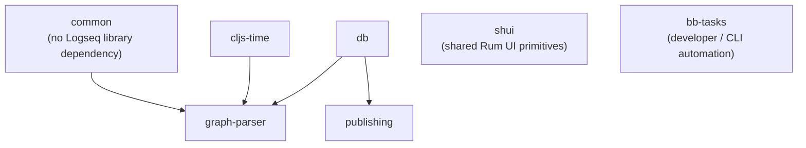

# Repository map

## Architectural source sets

| Path                    | Responsibility                               | Notes                                                                                                                        |
| ----------------------- | -------------------------------------------- | ---------------------------------------------------------------------------------------------------------------------------- |
| `src/main/frontend`     | Shared renderer application                  | Roughly 350 CLJS/CLJC files; UI, handlers, graph DB, parsing integration, extensions, search, and state.                     |
| `src/main/electron`     | Renderer-side Electron adapters              | IPC and listener abstractions used without importing Node directly into the renderer.                                        |
| `src/main/logseq`       | Public application API and plugin SDK bridge | The API exposed to plugins is implemented alongside the app.                                                                 |
| `src/electron/electron` | Electron main process                        | Window lifecycle, filesystem, watchers, search, git, updater, plugins, server, protocol handlers, and IPC.                   |
| `src/test`              | Main CLJS test suite                         | Compiled by Shadow CLJS to a Node test script.                                                                               |
| `src/bench`             | CLJS benchmarks                              | Separate Clojure alias and test runner.                                                                                      |
| `scripts/src`           | Babashka task implementations                | Development, publishing, validation, language, and file-sync automation.                                                     |
| `resources`             | Source assets and packaging inputs           | HTML, CSS, fonts, icons, preload bridge, and Electron Forge configuration.                                                   |
| `static`                | Desktop/web assembly output                  | Also a nested Node package used by Electron. Contains installed/generated material and should not be read as primary source. |

## Local Clojure libraries

The root [`deps.edn`](../deps.edn) composes local roots. This creates an
explicit domain dependency graph independent of JavaScript workspaces.

`shui` and `bb-tasks` are intentionally shown as independent support libraries:
the former is consumed by the UI, while the latter is imported by `bb.edn` task
definitions rather than forming part of the graph-parser runtime chain.

- `deps/common`: portable utilities intended for both compiled CLJS and
  `nbb-logseq`.
- `deps/db`: minimal DataScript schema/rules API shared with command-line
  tooling.
- `deps/graph-parser`: parses graph files into DataScript; its documented
  primary APIs are `parse-file` for the frontend and `parse-graph` for Node CLI
  use.
- `deps/publishing`: publishing-specific code built on the database model.
- `deps/shui`: shared Rum UI components and callbacks into host context.
- `deps/bb-tasks`: reusable Babashka `nbb` and domain-specific Datalog tasks.
- `deps/cljs-time`: a locally carried fork/library dependency.

The root app depends on `common`, `graph-parser`, `publishing`, and `shui`
directly. `db` is reached transitively through `graph-parser` and `publishing`,
although frontend namespaces also import `logseq.db.*`; this implicit
availability makes the dependency graph less obvious than declaring `logseq/db`
at the root.

## JavaScript and TypeScript subprojects

| Project                | Tooling/runtime                         | Role                                                               |
| ---------------------- | --------------------------------------- | ------------------------------------------------------------------ |
| Root `package.json`    | Yarn, Shadow CLI wrapper, Gulp, PostCSS | Shared JS dependencies and top-level scripts.                      |
| `static/package.json`  | Yarn, Electron Forge                    | Runtime dependencies and packaging for the assembled desktop app.  |
| `libs`                 | TypeScript, Webpack, TypeDoc            | Published Logseq plugin SDK (`@logseq/libs`).                      |
| `packages/ui`          | React, TypeScript, Parcel, Storybook    | React/Radix UI island emitted as a global bundle consumed by CLJS. |
| `packages/amplify`     | React, Parcel                           | AWS Amplify UI emitted as a global bundle.                         |
| `tldraw`               | Yarn workspaces, React/TS               | Vendored/forked whiteboard implementation and Logseq adapter.      |
| `deps/*/package.json`  | Yarn, `nbb-logseq`                      | Node-based tests for portable CLJS libraries.                      |
| `scripts/package.json` | Yarn                                    | Script-specific Node dependencies.                                 |

There is no root Yarn `workspaces` declaration tying these together.
Installation is recursive and selective: root `postinstall` installs/builds
tldraw and Amplify, while other packages have their own lockfiles and commands.
This isolation prevents some dependency collisions but weakens unified
dependency policy and reproducibility.

## Domain-oriented renderer namespaces

- `frontend.components`: Rum view components; many are feature-scale rather than
  purely presentational.
- `frontend.handler`: commands and orchestration for blocks, pages,
  repositories, files, routes, export, sync, UI, plugins, and configuration.
- `frontend.modules.outliner`: transaction and file-write pipeline for
  structural editing.
- `frontend.db`: connection lifecycle, queries, migrations, persistence, and
  reactive subscriptions.
- `frontend.fs`: browser and Electron filesystem abstraction/synchronization.
- `frontend.extensions`: code editor, drawing tools, SRS, PDF, video, and other
  rich content.
- `frontend.state`: the global application atom, event publication, selectors,
  and imperative registries.
- `logseq.api` and `logseq.sdk`: plugin-facing application surface.

The namespace organization communicates feature ownership, but dependency
direction is not strongly enforced. Components call handlers and database
functions, handlers often update global state directly, and `frontend.state`
also contains registries for components and plugin services. This is a pragmatic
modular monolith, not a layered architecture with hard boundaries.
